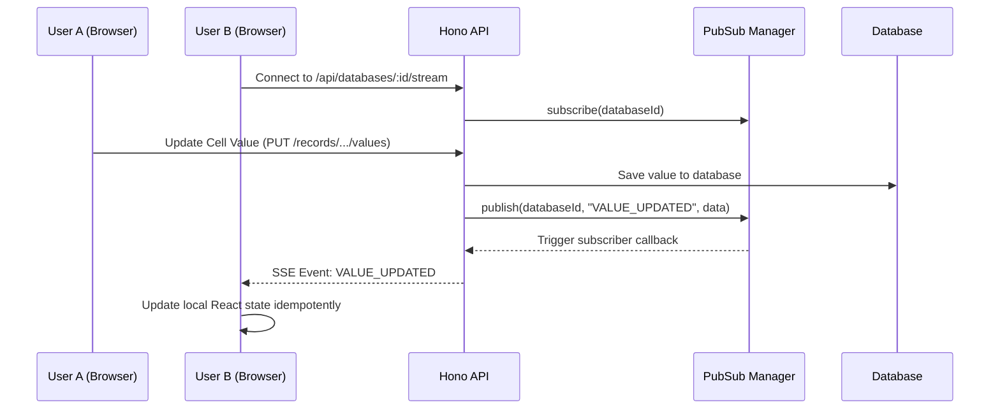

# Dynamic Field System — Code Reference

> **Stack:** Prisma + PostgreSQL · Hono API · React + shadcn/ui  
> **Entry point:** `http://localhost:2001/test`

---

## 1. Architecture Overview

```
Browser (/test)
  └── DynamicFieldPage.tsx            ← slim orchestrator (uses hooks + components)
        ├── hooks/
        │   ├── useDatabase.ts        ← DB list, create, select
        │   ├── useFields.ts          ← field CRUD (rename, delete, move, duplicate, icon, backfill)
        │   └── useRecords.ts         ← record create (with ID auto-fill), value set
        ├── cells/                    ← one file per cell type
        │   ├── index.tsx             ← CellEditor dispatcher + barrel exports
        │   ├── shared.tsx            ← CellProps, ActiveProps, OptionChip, CellTrigger
        │   ├── TextCell.tsx
        │   ├── NumberCell.tsx
        │   ├── DateCell.tsx
        │   ├── SelectCell.tsx
        │   ├── MultiSelectCell.tsx
        │   ├── CheckboxCell.tsx
        │   ├── ComputedCell.tsx
        │   └── PersonCell.tsx
        ├── CellEditors.tsx           ← thin re-export shim → cells/index.tsx
        ├── AddFieldDrawer.tsx        ← Sheet panel for creating fields
        ├── EditFieldDrawer.tsx       ← Sheet panel for editing existing fields
        ├── api.ts                    ← typed fetch client
        ├── constants.tsx             ← field type metadata, formatters
        └── types.ts                  ← shared TypeScript interfaces

Hono API (localhost:4001)
  └── apps/api/src/index.ts           ← all REST routes

Database package
  ├── prisma/schema.prisma            ← Prisma models
  ├── prisma/seed.ts                  ← seeds test data + 10 DynUsers (Dicebear avatars)
  ├── queries.ts                      ← all DB query functions
  ├── filter.ts                       ← backend filter evaluator used by filtered record queries
  └── client.ts                       ← Prisma client singleton
```

---

## 2. Database Schema

### `packages/database/prisma/schema.prisma`

| Model | Table | Purpose |
|---|---|---|
| `DynDatabase` | `dyn_databases` | A named container (like a Notion database) |
| `Field` | `dyn_fields` | Column definition with type + config |
| `FieldOption` | `dyn_field_options` | Choices for `select` / `multi_select` fields |
| `DynRecord` | `dyn_records` | A row of data |
| `FieldValue` | `dyn_field_values` | EAV value row — one per (record × field) |
| `DynUser` | `dyn_users` | Users available for `person` fields |

**`FieldType` enum** — 15 types: `text`, `number`, `select`, `multi_select`, `date`, `person`, `checkbox`, `file`, `url`, `email`, `id`, `created_time`, `created_by`, `updated_time`, `updated_by`

**`FieldValue` — typed EAV columns:**

```prisma
model FieldValue {
  textValue        String?
  numberValue      Decimal?   @db.Decimal(20, 6)
  selectValue      String?    // FieldOption.id
  multiSelectValue String[]   // array of FieldOption.id
  dateValue        DateTime?  @db.Timestamptz(6)
  personValue      String[]   // array of DynUser.id
  boolValue        Boolean?
  jsonValue        Json?
}
```

**`DynUser` model:**

```prisma
model DynUser {
  id        String   @id @default(uuid())
  name      String
  email     String   @unique
  avatarUrl String?
  createdAt DateTime @default(now())
  updatedAt DateTime @updatedAt
  @@map("dyn_users")
}
```

**`Field.config`** stores type-specific settings as JSON:

| Type | Config shape |
|---|---|
| `date` | `{ dateFormat, includeTime }` |
| `number` | `{ numberFormat, precision, currency }` |
| `text` | `{ richText }` |
| `person` | `{ allowMultiple, allowedUserIds? }` — `allowedUserIds` restricts the picker to specific user IDs |
| `select` / `multi_select` | _(options stored in `FieldOption` table)_ |
| any | `{ customIcon }` — Lucide icon name override |

---

## 3. Database Queries

### `packages/database/queries.ts`

Import path: `@local/database`

#### Database
| Function | Description |
|---|---|
| `getDynDatabases()` | List all with `_count` of fields + records |
| `createDynDatabase(name)` | Create a new database |

#### Fields
| Function | Description |
|---|---|
| `getFields(databaseId)` | Ordered by `position`, includes options |
| `createField(databaseId, name, type, opts?)` | Auto-assigns position |
| `updateField(fieldId, { name?, config? })` | Rename or patch config |
| `deleteField(fieldId)` | Cascades to all `FieldValue` rows |
| `reorderField(fieldId, direction)` | Swap with left/right neighbour |
| `duplicateField(fieldId)` | Copy field + options, insert after original |
| `backfillIdField(fieldId, databaseId)` | Set `textValue = rowNumber` for all records missing this field's value |

#### Field Options
| Function | Description |
|---|---|
| `getFieldOptions(fieldId)` | Ordered by position |
| `createFieldOption(fieldId, label, color?)` | Auto-assigns position |
| `deleteFieldOption(optionId)` | Delete a single option |

#### Records + Values
| Function | Description |
|---|---|
| `getDynRecords(databaseId)` | Non-archived records with `fieldValues + field` |
| `getFilteredDynRecords(databaseId, filter)` | Loads records + fields and applies backend filter AST |
| `createDynRecord(databaseId)` | Auto-increments `rowNumber` |
| `setFieldValue(recordId, fieldId, payload)` | Upsert; coerces date strings + number strings |

#### Users
| Function | Description |
|---|---|
| `getUsers()` | All users ordered by name |
| `searchUsers(q)` | Case-insensitive name/email search, max 20 |
| `upsertDynUser(name, email, avatarUrl?)` | Create or update (idempotent, keyed on email) |

---

## 4. API Routes

### `apps/api/src/index.ts` — Hono on port `4001`

#### Databases
| Method | Path | Body / Notes |
|---|---|---|
| `GET` | `/api/databases` | |
| `POST` | `/api/databases` | `{ name }` |

#### Fields
| Method | Path | Body / Notes |
|---|---|---|
| `GET` | `/api/databases/:id/fields` | |
| `POST` | `/api/databases/:id/fields` | `{ name, type, config? }` |
| `PATCH` | `/api/fields/:fieldId` | `{ name?, config? }` |
| `DELETE` | `/api/fields/:fieldId` | |
| `POST` | `/api/fields/:fieldId/move` | `{ direction: 'left'|'right' }` |
| `POST` | `/api/fields/:fieldId/duplicate` | |
| `POST` | `/api/fields/:fieldId/backfill` | `{ databaseId }` — fills `id`-type field for existing rows |

#### Field Options
| Method | Path | Body |
|---|---|---|
| `GET` | `/api/fields/:fieldId/options` | |
| `POST` | `/api/fields/:fieldId/options` | `{ label, color }` |
| `DELETE` | `/api/fields/:fieldId/options/:optionId` | |

#### Records + Values
| Method | Path | Body |
|---|---|---|
| `GET` | `/api/databases/:id/records` | |
| `POST` | `/api/databases/:id/records/filter` | `{ filter }` |
| `POST` | `/api/databases/:id/records` | |
| `PUT` | `/api/records/:recordId/values/:fieldId` | `FieldValuePayload` |

Backend filter process:

- Filter edits originate in the web filter builder.
- The view save is debounced in `ViewManagerTabBar.tsx` before `PATCH /api/views/:viewId`.
- The server persists the filter tree into `Filter.config`.
- The page requests matching rows from `POST /api/databases/:id/records/filter`.
- The API resolves the result through `getFilteredDynRecords(...)` and `packages/database/filter.ts`.

#### Users
| Method | Path | Notes |
|---|---|---|
| `GET` | `/api/users` | `?q=` for search |
| `POST` | `/api/users` | `{ name, email, avatarUrl? }` — upsert |

---

## 5. Frontend — Hooks

### `hooks/useDatabase.ts`
- `databases`, `selectedDb` — state
- `createDatabase(name)` — creates + refreshes list
- `selectDatabase(db)` — sets active db

### `hooks/useFields.ts`
- `fields`, `loadFields(dbId)` — fetch
- `addField(dbId, name, type, config, pendingOptions)` — create + options; auto-backfills `id`-type immediately
- `renameField(fieldId, name)`, `deleteField(fieldId)`, `moveField(fieldId, dir, dbId)`, `duplicateField(fieldId, dbId)`
- `changeIcon(fieldId, iconName, currentConfig)` — patches `config.customIcon`
- `updateField(updated)` — optimistic local update

### `hooks/useRecords.ts`
- `records`, `loadRecords(dbId)` — fetch
- `addRecord(dbId, idFields)` — creates record; auto-writes `rowNumber` into all `id`-type field values
- `setValue(record, field, payload)` — upsert + optimistic update
- `removeFieldValues(fieldId)` — local cleanup after field delete
- `reloadRecords(dbId)` — force re-fetch from server

### Filtered record loading
- `DynamicFieldPage.tsx` calls `api.records.listFiltered(dbId, filter)` when the active view has a saved filter.
- Record filtering is backend-driven; the page receives already-filtered rows.

---

## 6. Frontend — Cell Editors

### `CellEditors.tsx`

| Component | Field types | Behaviour |
|---|---|---|
| `TextCell` | `text`, `url`, `email`, others | **Inline** — click to show `<Input>` + ✓ button inline in cell; ESC cancels |
| `NumberCell` | `number` | Popover; formats display via `formatNumberValue` |
| `DateCell` | `date` | Calendar popover; day-click immediately saves (date-only); Apply button for date+time |
| `CheckboxCell` | `checkbox` | Instant save on toggle |
| `SelectCell` | `select` | Popover list of options |
| `MultiSelectCell` | `multi_select` | Popover checkbox list |
| `PersonCell` | `person` | Popover with search bar + avatar list; single or multi select |
| `ComputedCell` | `id`, `created_time`, etc. | Read-only derived value |
| `OptionChip` | — | Coloured chip for option labels |
| `CellEditor` | all | Dispatcher — passes `isActive`, `onActivate`, `onDeactivate` to `TextCell` |

### Active Cell State

Managed in `DynamicFieldPage`:

```ts
const [activeCell, setActiveCell] = useState<{ recordId: string; fieldId: string } | null>(null);
```

- Clicking a `<td>` activates it → **border-color changes to primary** (no background change)
- Clicking outside the table clears it
- `ESC` anywhere clears it (global keydown listener)
- `TextCell` watches `isActive` to enter/exit inline editing mode and **auto-focuses** via `requestAnimationFrame`

---

## 7. Person Field

The `person` field stores an array of `DynUser.id` in `personValue[]`.

**PersonCell** (`cells/PersonCell.tsx`):
- Loads all users on mount via `api.users.list()`
- If `field.config.allowedUserIds` is set and non-empty, the list is pre-filtered to those IDs only
- Client-side filters by name/email as user types
- Toggle: if `allowMultiple = false`, selecting a user closes the popover immediately
- Displays selected users as chips (`PersonChip`) with Dicebear avatar image
- Shows a "Clear" button when selection is non-empty
- Shows a badge counting allowed members when the pool is restricted

**Config:**
- `field.config.allowMultiple: boolean` — single vs multi select
- `field.config.allowedUserIds?: string[]` — when set, only these users appear in the picker; configurable via **Add/Edit Field drawer** with a checkbox list

**Seed:**  
Run `pnpm --filter @local/database run db:seed` to populate 10 `DynUser` rows with Dicebear `avataaars/png` avatars (unique per name, pastel backgrounds).

---

## 8. ID Field Auto-fill

When the user creates a field with `type = 'id'`:
1. `useFields.addField` calls `api.fields.backfill(fieldId, databaseId)` immediately after creation
2. The API calls `backfillIdField(fieldId, databaseId)` which upserts `textValue = String(rowNumber)` for all existing records that don't yet have a value

When the user clicks **+ Add record**:
1. `useRecords.addRecord(dbId, idFields)` creates the record
2. For each `id`-type field, it immediately calls `api.values.set(record.id, field.id, { textValue: String(record.rowNumber) })`
3. The field value is included in the new record's `fieldValues` optimistically

---

## 9. Real-time Database Synchronization Strategy

We use Server-Sent Events (SSE) and an in-memory PubSub system to synchronize database changes (e.g., adding records, updating cell values) across multiple client sessions in real-time.

### Architecture Overview



### How it Works

1. **Connection**: Clients connect to the `GET /api/databases/:id/stream` endpoint. The server holds this connection open using `streamSSE` and subscribes to events for that specific `databaseId` via the `PubSub` manager.
2. **Mutation**: When a user performs a write operation (e.g., creating a row or editing a cell), the backend performs the database mutation and immediately calls `dbEvents.publish(...)` with the new data.
3. **Broadcast**: The `PubSub` manager iterates through all active connections for that `databaseId` and pushes the event down their respective SSE streams.
4. **Idempotent Updates**: The frontend receives the event and updates its local state (e.g., React `useState`). The updates are designed to be idempotent (e.g., checking if a record ID already exists before adding it) to avoid duplicating data if the client receives an event for an action it performed itself.

> [!NOTE]
> The current `PubSub` implementation is in-memory. If deploying multiple API instances (e.g., horizontally scaled containers), this should be replaced with a distributed message broker like Redis Pub/Sub to ensure events broadcasted from one instance reach clients connected to another.

### Testing Real-time Sync (Postman Examples)

You can trigger SSE broadcasts by interacting with the API directly. Ensure you include the `databaseId` in the body so the backend routes the event to the correct stream.

| Action | Method | URL | Body (Raw JSON) | Notes |
| :--- | :---: | :--- | :--- | :--- |
| **New Row Request** | `POST` | `http://localhost:4001/api/databases/:databaseId/records` | *(None required)* | Creates a new empty row. Returns the new record object. |
| **Update Request** (Cell Value) | `PUT` | `http://localhost:4001/api/records/:recordId/values/:fieldId` | `{ "databaseId": "db-uuid", "textValue": "Hello!" }` | Replaces `textValue` with `numberValue`, `selectValue`, `dateValue`, etc., depending on the field type. `databaseId` is required to trigger SSE broadcast. |
| **Delete Row Request** | `DELETE` | `http://localhost:4001/api/records` | `{ "databaseId": "db-uuid", "ids": ["record-uuid-1"] }` | Deletes the specified records. `databaseId` is required to trigger SSE broadcast. |

---

## 10. Data Flow Examples

### Create a record

```
User clicks "+ Add record"
  → useRecords.addRecord(dbId, idFields)
  → api.records.create(dbId)                POST /api/databases/:id/records
  → for each id field: api.values.set(...)  PUT /api/records/:id/values/:fieldId
  → append to records state
```

### Create a person field

```
User picks type = "person", toggles "Allow multiple", clicks "Add field"
  → useFields.addField(dbId, name, 'person', { allowMultiple: true }, [])
  → api.fields.create(...)
  → setFields(prev => [...prev, newField])
```

### Person cell interaction

```
User clicks person cell
  → PersonCell popover opens
  → users loaded from api.users.list()
  → user types "ali" → filtered list updates
  → user clicks a user row
  → onSave({ personValue: [userId] })
  → api.values.set(recordId, fieldId, { personValue: [...] })
```

---

## 11. Known Limitations / Next Steps

- **No auth** — `created_by` / `updated_by` always show "System". Wire to Better Auth session when ready.
- **User management UI** — Users can be created via `POST /api/users` (or seeded directly). No admin panel yet.
- **No column resizing** — widths fixed at 180px via `<colgroup>`.
- **No pagination** — all records loaded at once. Add cursor-based pagination for large datasets.
- **Filter / Sort / Group** — not yet implemented.
- **Rich text** — `text` field has a `richText` config toggle but the editor is still a plain `<input>`. Wire to a Tiptap/ProseMirror editor when needed.
